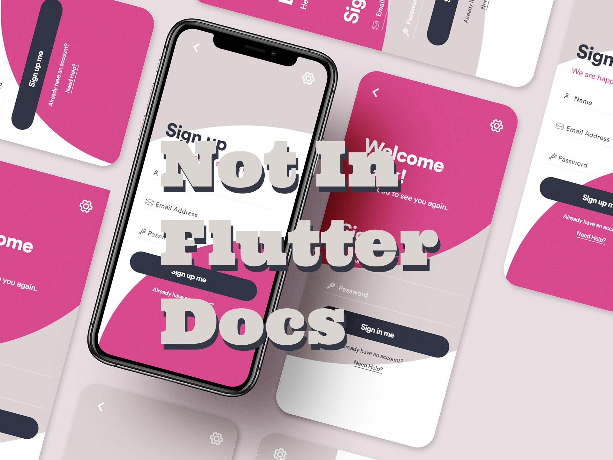

# Not In Flutter Docs

It says it all. Not In Flutter Docs, a sort of underground guide to flutter app development and design.

## Licenses

Code is under BSD clause-2 license copyright by Fred Grott(Fredrick Allan Grott).  Content in the articles and book 
is under commerical copyright by Fredrick Allan Grott.

## Articles

Flutter Basics

DevOPS

[Flutter Missing Best Practices, Brand Error Widgets](https://medium.com/p/flutter-missing-best-practices-brand-error-widgets-d9d71ace61ff)

[Missing Flutter Best Pratices, Revisited](https://medium.com/p/missing-flutter-best-practices-revisited-876c6aa284fd)

State

[Flutter State Management AntiPatterns](https://medium.com/p/flutter-state-management-antipatterns-68b3dbaafa67)

[Flutter Reactive And BLoC Training Wheels](https://medium.com/p/flutter-reactive-and-bloc-training-wheels-a8e9fa4730aa)

UI

Cross-Platform

[Expert Flutter Cross Platform ThemeING](https://medium.com/p/expert-flutter-cross-platform-themeing-8c7a7f3707cd)

Widgets

[Writing Your First Flutter Widget And Best Practices](https://medium.com/p/writing-your-first-flutter-widgetand-best-practices-8dc0ea74dc86)

Layout

## About Fred Grott

I'm developing a teaching series about Flutter App Development and Design. My articles appear on in several online Medium publishers and on my medium blog:

[Fred Grott's medium blog](https://fredgrott.medium.com)

### My Social Links

You Can Follow Me At

[Medium](https://fredgrott.medium.com)

[Keybase](https://keybase.io/fredgrott)

[Twitter](https://twitter.com/fredgrott)

[GitHub](https://github.com/fredgrott)

[Xing](https://www.xing.com/profile/Fred_Grott/cv)

[LinkedIN](https://www.linkedin.com/in/fredgrottstartupfluttermobileappdesigner/)

[Reddit](https://www.reddit.com/user/fredgrott)

[Dribbble](https://dribbble.com/FredGrott)

[BeHance](https://www.behance.net/gwsfredgrott)
